[Visit live website](https://ericawall.github.io/portfolio-project-2/)

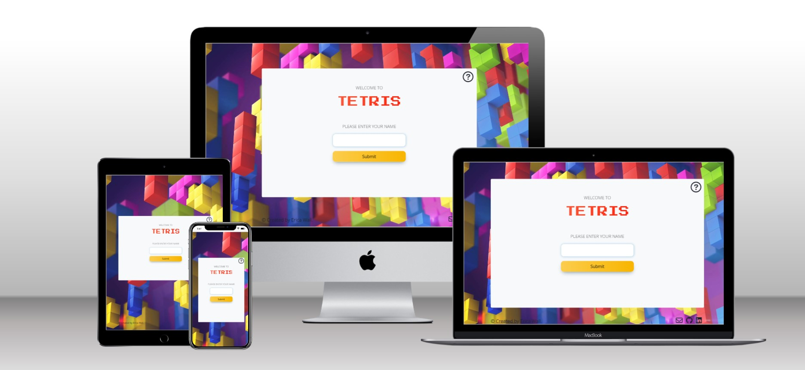

## Table of Content
  - [Project Goals](#project-goals)
    - [User Goals](#user-goals)
    - [Site Owner Goals](#site-owner-goals)
  - [User Experience](#user-experience)
    - [Target Audience](#target-audience)
    - [User Requirements and Expectations](#user-requirements-and-expectations)
  - [User Expectations](#user-stories)
    - [Site User](#site-user)
    - [Site Owner](#site-owner)
  - [Design](#design)
    - [Colour Scheme](#colour-scheme)
    - [Fonts](#fonts)
    - [Structure](#structure)
    - [Wireframes](#wireframes)
  - [Technologies Used](#technologies-used)
    - [Languages](#languages)
    - [Frameworks, Libraries & Tools](#frameworks-libraries--tools)
  - [Features](#features)
  - [Validation](#validation)
    - [HTML Validation](#html-validation)
    - [CSS Validation](#css-validation)
    - [JavaScript Validation](#javascript-validation)
    - [Accessibility](#accessibility)
    - [Performance](#performance)
  - [Testing](#testing)
    - [Performing tests on various devices](#performing-tests-on-various-devices)
    - [Browser compatibility](#browser-compatibility)
    - [Testing user stories](#testing-user-stories)
  - [Bugs](#bugs)
  - [Deployment](#deployment)
  - [Credits](#credits)
  - [Acknowledgements](#acknowledgements)

## Project Goals

The goal of this project was to create a simple, interactive and user-friendly version of the well-known Tetris game.

### User Goals

- Play a game with simple rules that is fun and engaging.
- Challenge themselves on different words and phrases.

### Site Owner Goals

- Create a game which is entertaining and engaging.
- Create visually appealing design.
- Create a simple navigation around website.
- Provide fully responsive and accessible website.

## User Experience

### Target Audience

- The game can be played by people of all ages and cultures.
- Anyone who wants to have fun playing a game with simple and clear rules.

### User Requirements and Expectations

- Easy to understand game rules.
- Simple navigation.
- Simple presentation of content on the page that makes logical sense.
- A responsive wesite that allows the user to play the game on any device.
- Links and functions that work as expected.
- An easy way to contact the developer and leave feedback.
- Accessibility.

## User Requirements

### Site User

1. I want to easily understand the rules of the game.
2. I want to enter my name and have it visible on screen while the game is played.
3. I want to be able to play the game by using the keyboard.
4. I want to be able to play the game on desktop, tablet and mobile devices.
5. I want to be able to get in touch with the developer.
6. I want to be sure that my message has been sent.

### Site Owner

7. I want user to easily understand the game.
8. I want the user to be able to challenge themselves.
9. I want my game to be fully responsive.
10. I want the user to come to a 404 error page instead of having to use the browser back button if they enter a url that does not exist.
11. I want user to be able to contact me and provide their feedback.

## Design

### Colour Scheme

The colour scheme across the screens was kept simple and consistent and was inspired by the retro colours of the original tetris game pieces (called tetrominos").
- Game title is red, game navigation buttons are orange, highlights are in shades of light blue.

### Fonts

Google Fonts were implemented on the website. Noto Sans with sans-serif fallback was used across all screens as I found it highly readable and clear. To reflect the retro aspect of the game, the Press Start 2P with a cursive fallback was used for the game title, instructions and game over headings.

### Structure

The structure of the website was designed to be easy to learn and navigate. Each screen of the game appears in the same container with maintained harmony of all elements within.

- The game consist of the following screens:
  - A home page / start screen with instructions icon in the top line, game title and user login.
  - Main game screen - it contains the tetris game, current score and current level.
  - Game over screen - the option to restart the game is shown.
- A modal with game instructions which pops up when the instructions icon is clicked, available on all game screens.
- The contact page with contact form which allows users to send an email to the developer and provide their feedback
- A contact form submitted page, with a button to return to the home page.
- A separate 404 error page.

### Wireframes

Big screens - laptop & desktop

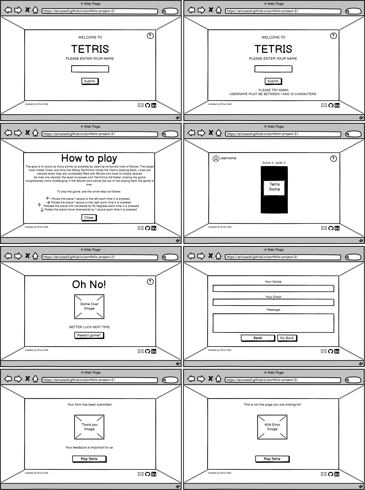

Medium screens - tablets

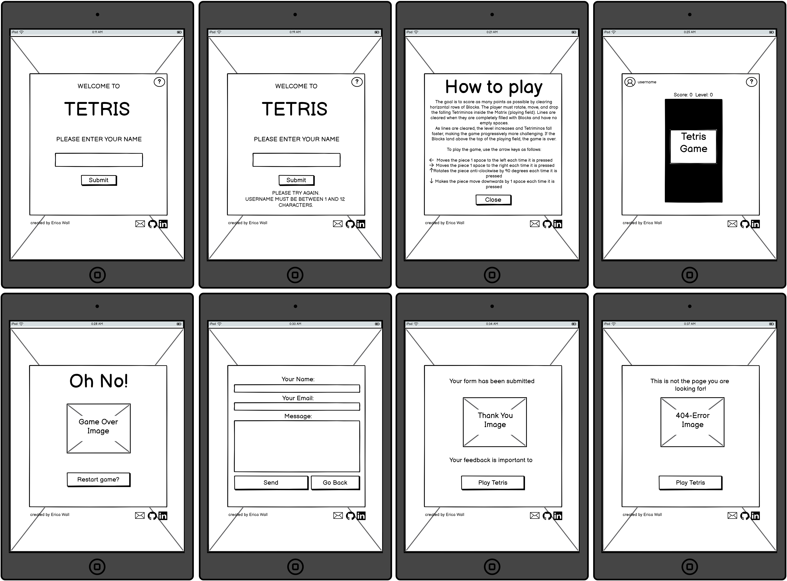

Small screens - mobile

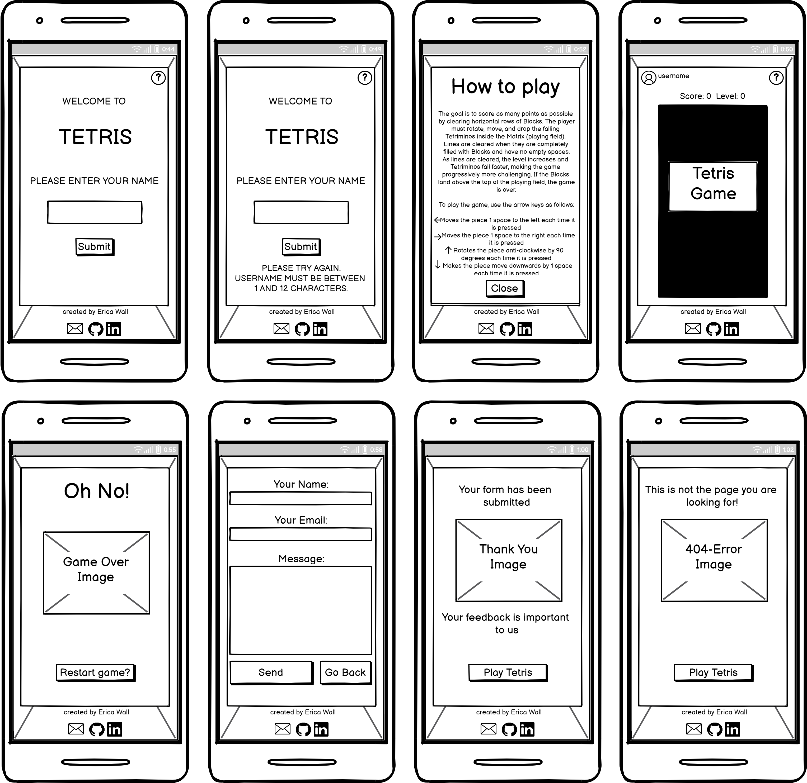

## Technologies Used

### Languages

- HTML
- CSS
- JavaScript

### Frameworks, Libraries & Tools

- [Techsini](https://techsini.com/multi-mockup/index.php) was used to create the multi-device mock-up you can see at the start of this README.md file.
- [Balsamiq](https://balsamiq.com/) to create the wireframes for the project.
- [Bootstrap v5.1.3](https://getbootstrap.com/).
- [EmailJS](https://www.emailjs.com) used to send email from the contact form.
- [Font Awesome](https://fontawesome.com/) - Icons from Font Awesome were used throughout the site.
- [Git](https://git-scm.com/) was used for version control within VSCode to push the code to GitHub.
- [GitHub](https://github.com/) was used as a remote repository to store project code.
- [Google Fonts](https://fonts.google.com/).
- [Chrome dev tools](https://developers.google.com/web/tools/chrome-devtools) were used for debugging of the code and check site for responsiveness.
- [WC3 Validator](https://validator.w3.org/), [Jigsaw W3 Validator](https://jigsaw.w3.org/css-validator/), [Lighthouse](https://developers.google.com/web/tools/lighthouse/) and [JShint](https://jshint.com/) were all used to validate the website.

## Features

The website has 3 webpages consisting of 9 distinct features described below:

### Home screen

#### Title animation
- When the page is loaded the game title fades-in.

See feature

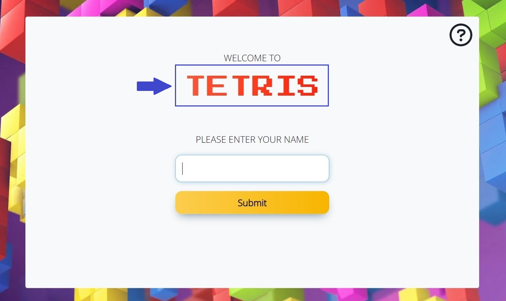

#### Username input
- User is asked to enter their name in the input field. The username needs to be between 1 and 12 characters long. The are no restrictions on characters type. However, if the input field is left blank, then a feedback message is displayed for user to try again. Once a valid username has been provided, the name is displayed next to the user icon on the next screen and user is able to select the difficulty level of the game.
- Username remains displayed on all game screens

See feature

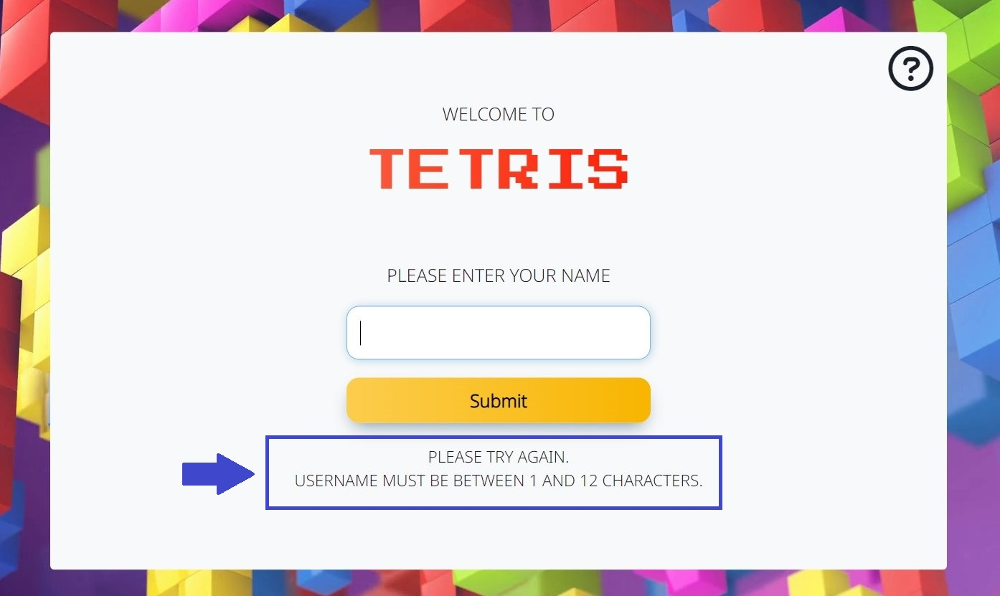

### Instructions Modal
- A modal with game instructions which pops up when the instructions icon is clicked
- Available on all game screens
- Background color is set slightly darker than on the game screen

See feature

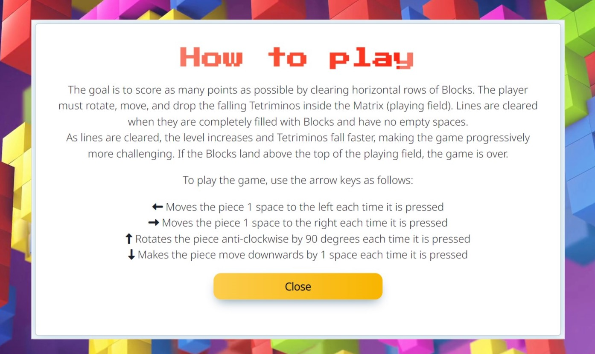

### Footer
- Featured on all pages
- Contains link to contact form (opening in the same window), github page and social media (opening in a separate window)

See feature

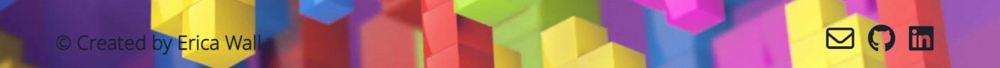

### Game screen
- The below elements are displayed on the screen:
  - Username
  - Game instructions icon
  - Tetris Game
  - Current score and level

See feature

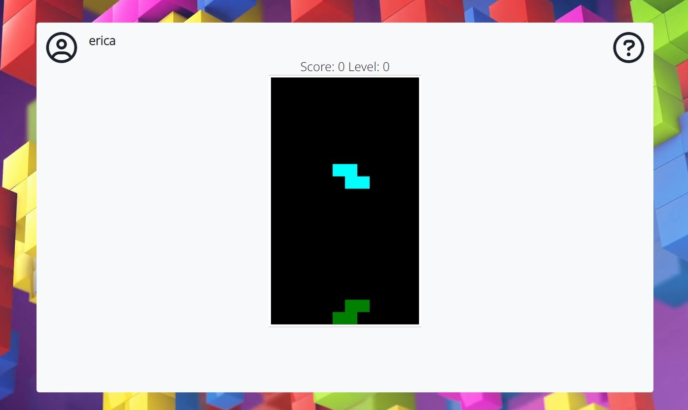

### Game Over Screen
- The below elements are displayed on the screen:
  - Username
  - Picture of game over with a tetris theme
  - Button to restart the game

See feature

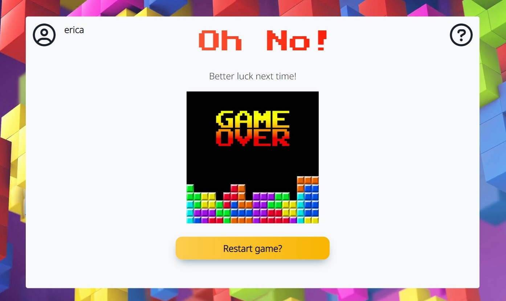

### Contact Form
- User is able to provide feedback about the game
- EmailJS has been used to send an email to developer with user's data and message

See feature

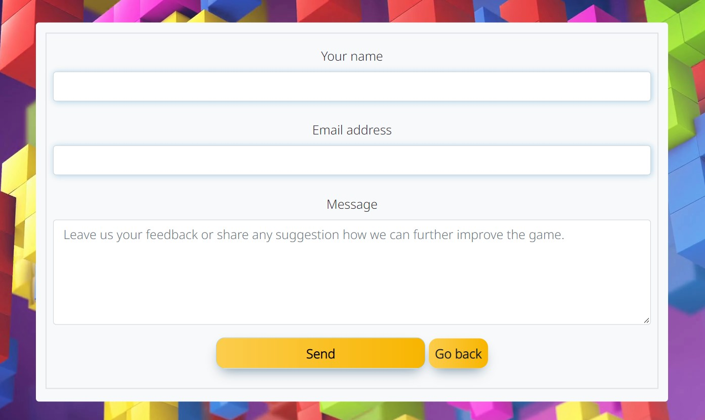

### Contact Form confirmation screen
- Thank you message is displayed
- Contains return to the main screen button
- Picture of thank you with a tetris theme

See feature

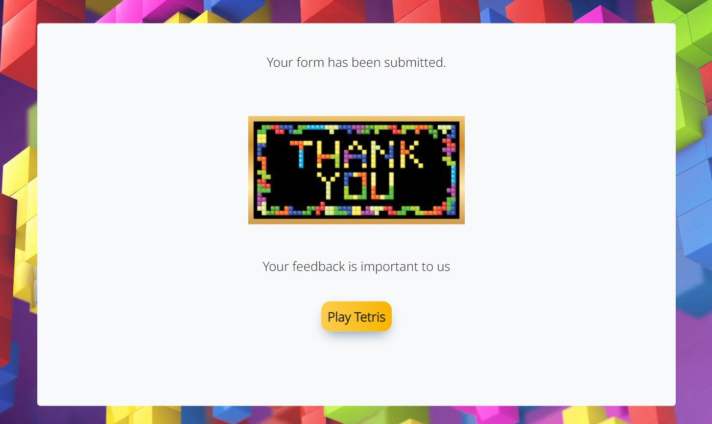

### 404 error page
- The site has been given a 404 error page which is displayed if the user enters a url that does not exist.
- Contains return to the main screen button
- Picture of 404 error message with a tetris-ish/pixelart thee

See feature

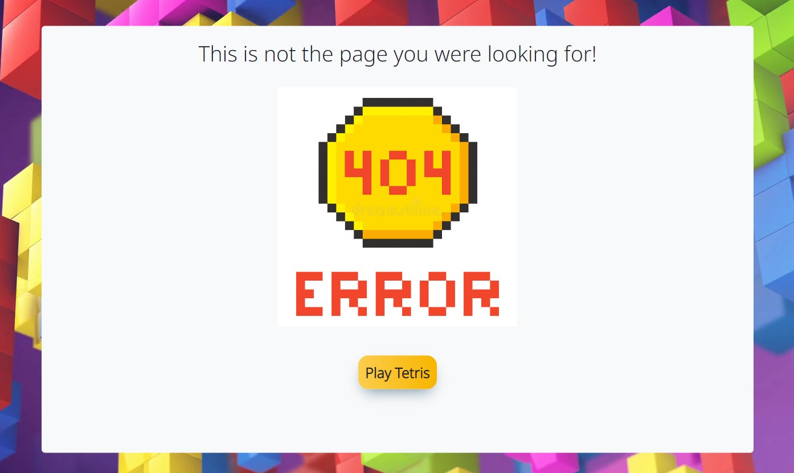

## Validation